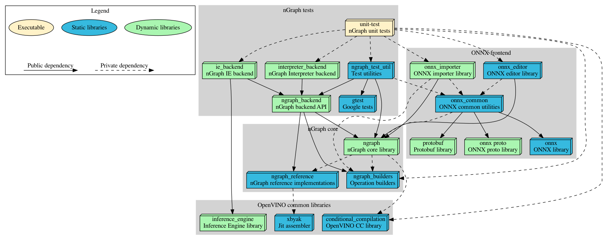

# nGraph Components

nGraph consists from several components:

 - nGraph core library contains default operation sets and basic classes and structures for graph representation.
 - ONNX frontend allows to convert ONNX models to nGraph Function.
 - nGraph unit tests contains tests for nGraph components.

Below you can find the dependencies graph for nGraph components.

